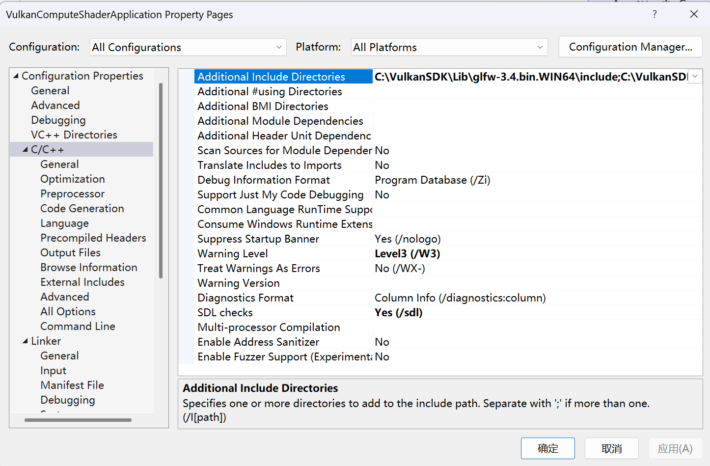
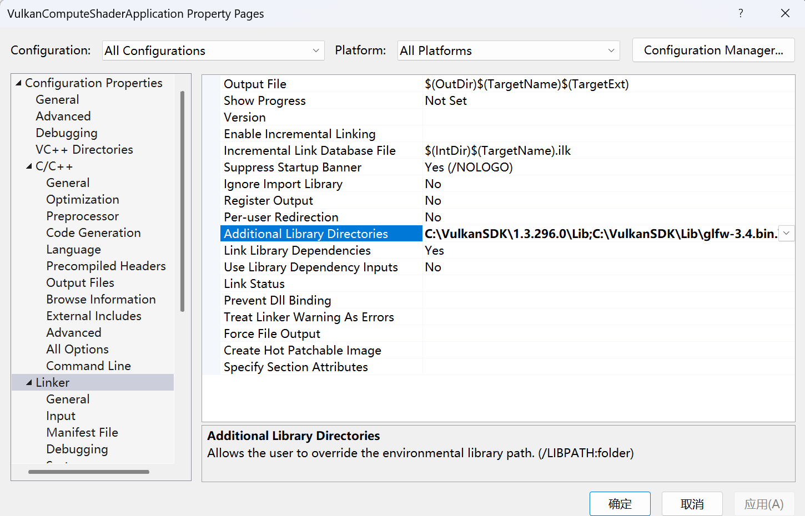
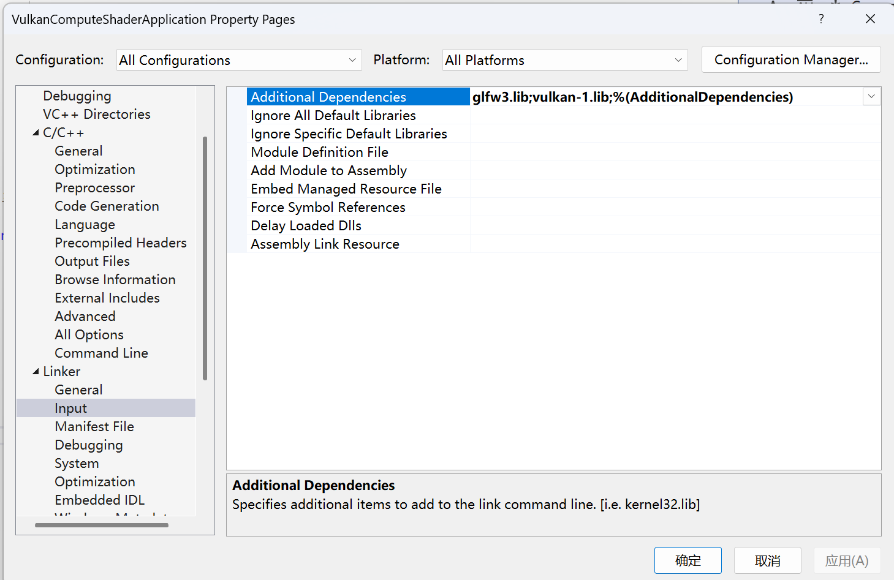

# RTVulkan

## 1. 编译

* 使用`VS2022`打开`RTVulkan.sln`文件。
* 检查并更改以下项目设置（和`Vulkan Turorial`中的环境配置步骤相同）

* 在`VS2022`中运行项目。

## 2. 运行

* 可自行编译，也可直接使用`x64`文件夹中构建好的`exe`文件。
* 可使用`WASD`移动相机。
* 观察控制台获得每秒的帧数信息。

## 3. 其他

* 优先选择独立显卡，可在`main.cpp`中更改`preferHighPerformanceGPU`的值切换使用集成显卡
* 默认分辨率为`1024x768`。可通过修改`main.cpp`和`shader.comp`中的`Width`和`Height`的值改变分辨率。
* 使用包围盒对模型光追计算进行优化，经测试可获得近一倍的性能提升。(RTX 4060: 50fps -> 90fps)
